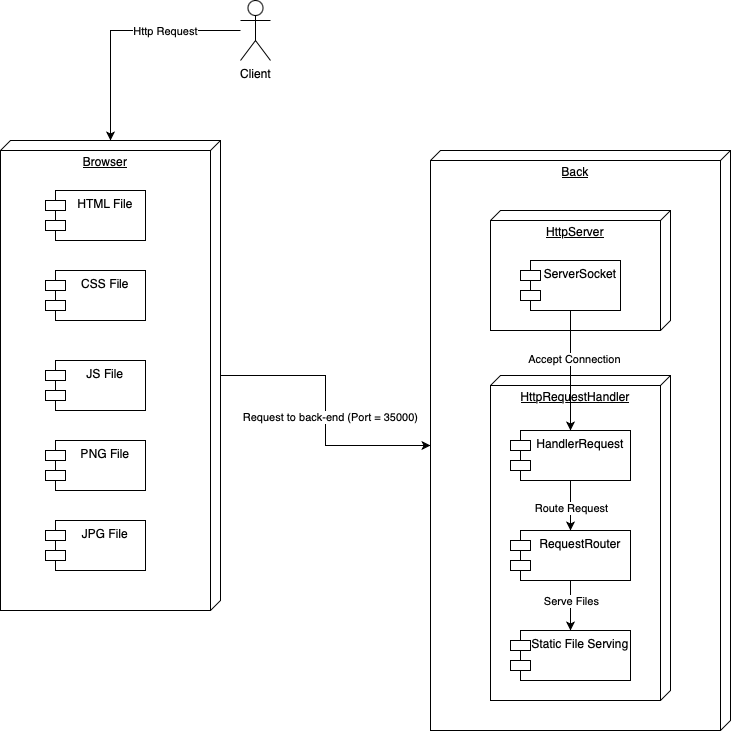
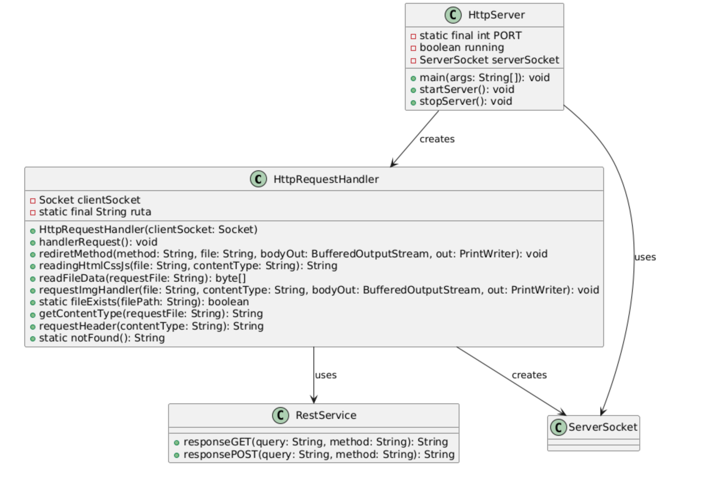
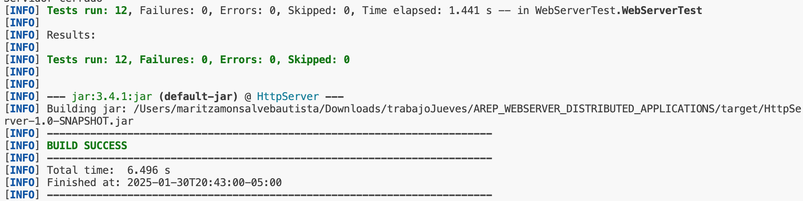

# Non-Concurrent Web Server

In this project, a non-concurrent web server was implemented in Java, capable of serving static files from a specific location and handling REST requests for GET and POST methods.


## Getting Started

The following instructions will allow you to run the project locally on your machine.

### Prerequisites

You need to have the following installed:

1. **Java** (versions 17 or 21)
   To verify the version in a console or terminal, run:

   ```sh
   java -version
   ```

   The output should look something like this:

   ```sh
   java version "17.0.12" 2024-07-16 LTS
   Java(TM) SE Runtime Environment (build 17.0.12+8-LTS-286)
   Java HotSpot(TM) 64-Bit Server VM (build 17.0.12+8-LTS-286, mixed mode, sharing)
   ```

2. **Maven**
   - To download, visit [here](https://maven.apache.org/download.cgi).
   - Follow the installation instructions [here](http://maven.apache.org/download.html#Installation).
   To verify the installation, run:

   ```sh
   mvn -v
   ```

   The output should look something like this:

   ```sh
   Apache Maven 3.9.9 (8e8579a9e76f7d015ee5ec7bfcdc97d260186937)
   Maven home: /Applications/apache-maven-3.9.9
   Java version: 17.0.12, vendor: Oracle Corporation, runtime: /Library/Java/JavaVirtualMachines/jdk-17.jdk/Contents/Home
   Default locale: es_CO, platform encoding: UTF-8
   OS name: "mac os x", version: "12.7.6", arch: "x86_64", family: "mac"
   ```

3. **Git**
   - To download, visit [here](https://git-scm.com/downloads).
   - Verify the installation by running:

   ```sh
   git --version
   ```

   The output should look something like this:

   ```sh
   git version 2.46.0
   ```

### Installation

1. Clone the repository and navigate to the folder containing the `pom.xml` file using the following commands:

   ```sh
   git clone https://github.com/Mar972310/AREP_WEBSERVER_DISTRIBUTED_APPLICATIONS.git
   cd AREP_WEBSERVER_DISTRIBUTED_APPLICATIONS
   ```

2. Build the project:

   ```sh
   mvn clean package
   ```

   The console output should look something like this:

   ```sh
   [INFO] --- jar:3.4.1:jar (default-jar) @ HttpServer ---
   [INFO] Building jar: /Users/maritzamonsalvebautista/Downloads/trabajoJueves/AREP_WEBSERVER_DISTRIBUTED_APPLICATIONS/target/HttpServer-1.0-SNAPSHOT.jar
   [INFO] ------------------------------------------------------------------------
   [INFO] BUILD SUCCESS
   [INFO] ------------------------------------------------------------------------
   [INFO] Total time:  6.496 s
   [INFO] Finished at: 2025-01-30T20:43:00-05:00
   [INFO] ------------------------------------------------------------------------
   ```

3. Run the application:

   ```sh
   java -cp target/HttpServer-1.0-SNAPSHOT.jar edu.escuelaing.arep.HttpServer
   ```

   The console should display the following message:

   ```sh
   Ready to receive ...
   ```

   You can now access static resources like `index.html` or other resources stored in the `resources` folder.

4. Search in the browser `http://localhost:35000/index.html`, also `http://localhost:35000/imagen1.png`


## Architecture



1. **HttpServer**

- **Role**: This is the main class of the server. It initializes a `ServerSocket` on the specified port and listens for incoming client connections. When a connection is received, it creates a new instance of `HttpRequestHandler` and delegates the responsibility of handling the client's request to this class.
- **Responsibilities**:
  - Accept incoming client connections.
  - Delegate the handling of each request to `HttpRequestHandler`.
  - Manage the server's lifecycle, including startup and shutdown.

  In your implementation, each time a client connects, the server handles it sequentially, meaning that it can only handle one connection at a time instead of using concurrency.

2. **HttpRequestHandler**

- **Role**: This class is responsible for processing individual client requests. It reads and processes the HTTP request, determines what file or resource should be served, and generates the appropriate response.
- **Responsibilities**:
  - Read and parse the client's HTTP request.
  - Serve static files from the specified directory or handle REST-like API requests.
  - Send appropriate HTTP responses to the client, handling errors like "404 Not Found" when a resource is not found.
  - Close the client socket after processing the request to avoid resource leaks.

  In your implementation, when the server accepts a connection, it creates an instance of `HttpRequestHandler` and uses it to handle the request sequentially (without concurrency).

### Interaction Flow

1. **Server Initialization**: The `HttpServer` starts and configures a `ServerSocket` on port 35000 (or the specified port). The server then waits for new client connections.

2. **Request Handling**:
   - When a client connects, the server accepts the connection and passes the socket to `HttpRequestHandler` to handle the request.
   - Inside `HttpRequestHandler`, the HTTP request is analyzed to determine what file or resource is being requested. Depending on the type of file or request (HTML, CSS, images, or POST/GET requests), the appropriate response is prepared.
   - The response is sent back to the client.

3. **Server Shutdown**: When the server needs to stop, the `ServerSocket` is closed and the server is gracefully shut down.

## Class Diagram


### Class Descriptions

1. **HttpRequestHandler**

**Responsibilities:**
- Manages incoming HTTP requests from the server.
- Reads the requested file or resource and sends the response back to the client.
- Handles static files such as HTML, CSS, JS, and images.
- Determines the content type and generates the necessary HTTP headers.
- Responds with a 404 error if the requested file does not exist.

**Methods:**
- `handlerRequest()`: Processes the HTTP request and determines the appropriate action.
- `rediretMethod()`: Redirects the request based on the method (GET or POST).
- `readingHtmlCssJs()`: Reads HTML, CSS, and JS files.
- `readFileData()`: Reads the data of the requested file.
- `requestImgHandler()`: Handles image requests and sends them to the client.
- `fileExists()`: Checks if the requested file exists.
- `getContentType()`: Gets the content type of a file.
- `requestHeader()`: Generates the necessary HTTP headers for the response.
- `notFound()`: Generates a 404 error response if the file is not found.

2. **HttpServer**

**Responsibilities:**
- Acts as the server that listens for incoming requests on a specific port.
- Starts and stops the server, managing client connections.

**Methods:**
- `startServer()`: Starts the server and begins accepting connections.
- `stopServer()`: Stops the server and closes open connections.
- `main()`: Main method to run the server.

3. **RestService**

**Responsibilities:**
- Provides responses to REST requests, specifically for GET and POST methods.

**Methods:**
- `responseGET()`: Generates a response for GET requests.
- `responsePOST()`: Generates a response for POST requests.

### Relationships Between Classes

- **HttpRequestHandler and RestService**: The `HttpRequestHandler` class uses `RestService` to handle REST requests. Specifically, it can invoke methods of `RestService` to process GET and POST requests.
  
- **HttpRequestHandler and ServerSocket**: `HttpRequestHandler` creates and manages the `ServerSocket` that receives client connections.
  
- **HttpServer and HttpRequestHandler**: `HttpServer` creates instances of `HttpRequestHandler` to delegate the management of incoming requests.
  
- **HttpServer and ServerSocket**: `HttpServer` uses the `ServerSocket` to accept client connections.

## Reporte de pruebas- Servidor web no concurrente

### Autor

Name: Maria Valentina Torres Monsalve

### Date

Date: 30/01/2024

### Test conducted


Test: `shouldLoadStaticFileHtml`
- **Description**: Verifies that the server is capable of serving static HTML files.
- **Objective**: Ensure that the server correctly serves files such as `index.html` from the designated directory.
- **Test Scenario**: A client requests the `index.html` file from the server.
- **Expected Behavior**: The server should respond with `HTTP/1.1 200 OK` and the correct content of the `index.html` file.
- **Verification**: Validation that the file is served correctly, ensuring the server handles static file requests.

Test: `notShouldLoadStaticFileHtml`
- **Description**: Verifies that the server responds appropriately when the requested file is not found.
- **Objective**: Ensure that the server responds with a `404 Not Found` status when a non-existing file is requested.
- **Test Scenario**: A client requests a non-existing file, such as `web.html`.
- **Expected Behavior**: The server should respond with `HTTP/1.1 404 Not Found`.
- **Verification**: Confirmation that the server correctly handles not found files.

Test: `shouldLoadStaticFileCss`
- **Description**: Verifies that the server is capable of serving static CSS files.
- **Objective**: Ensure that the server correctly serves files like `style.css`.
- **Test Scenario**: A client requests the `style.css` file from the server.
- **Expected Behavior**: The server should respond with `HTTP/1.1 200 OK` and the correct content of the CSS file.
- **Verification**: Validation that the CSS file is served correctly.

Test: `notShouldLoadStaticFileCss`
- **Description**: Verifies that the server responds appropriately when the requested CSS file is not found.
- **Objective**: Ensure that the server responds with a `404 Not Found` status when the file does not exist.
- **Test Scenario**: A client requests a non-existing CSS file, such as `styles.css`.
- **Expected Behavior**: The server should respond with `HTTP/1.1 404 Not Found`.
- **Verification**: Confirmation that the server correctly handles not found CSS files.

Test: `shouldLoadStaticFileJs`
- **Description**: Verifies that the server is capable of serving static JavaScript files.
- **Objective**: Ensure that the server correctly serves files like `script.js`.
- **Test Scenario**: A client requests the `script.js` file from the server.
- **Expected Behavior**: The server should respond with `HTTP/1.1 200 OK` and the correct content of the JavaScript file.
- **Verification**: Validation that the JavaScript file is served correctly.

Test: `notShouldLoadStaticFileJs`
- **Description**: Verifies that the server responds appropriately when the requested JavaScript file is not found.
- **Objective**: Ensure that the server responds with a `404 Not Found` status when the JavaScript file does not exist.
- **Test Scenario**: A client requests a non-existing JavaScript file, such as `prueba.js`.
- **Expected Behavior**: The server should respond with `HTTP/1.1 404 Not Found`.
- **Verification**: Confirmation that the server correctly handles not found JavaScript files.

Test: `shouldLoadStaticImagePNG`
- **Description**: Verifies that the server is capable of serving PNG images.
- **Objective**: Ensure that the server correctly serves images like `imagen2.png`.
- **Test Scenario**: A client requests the image `imagen2.png` from the server.
- **Expected Behavior**: The server should respond with `HTTP/1.1 200 OK` and the correct content of the PNG image.
- **Verification**: Validation that the PNG image is served correctly.

Test: `shouldLoadStaticImageJPG`
- **Description**: Verifies that the server is capable of serving JPG images.
- **Objective**: Ensure that the server correctly serves images like `imagen8.jpg`.
- **Test Scenario**: A client requests the image `imagen8.jpg` from the server.
- **Expected Behavior**: The server should respond with `HTTP/1.1 200 OK` and the correct content of the JPG image.
- **Verification**: Validation that the JPG image is served correctly.

Test: `notShouldLoadStaticImagePNG`
- **Description**: Verifies that the server responds appropriately when the requested PNG image is not found.
- **Objective**: Ensure that the server responds with a `404 Not Found` status when the requested image does not exist.
- **Test Scenario**: A client requests a non-existing PNG image, such as `imagen8.png`.
- **Expected Behavior**: The server should respond with `HTTP/1.1 404 Not Found`.
- **Verification**: Confirmation that the server correctly handles not found PNG images.

Test: `notShouldLoadStaticImageJPG`
- **Description**: Verifies that the server responds appropriately when the requested JPG image is not found.
- **Objective**: Ensure that the server responds with a `404 Not Found` status when the requested image does not exist.
- **Test Scenario**: A client requests a non-existing JPG image, such as `imagen2.jpg`.
- **Expected Behavior**: The server should respond with `HTTP/1.1 404 Not Found`.
- **Verification**: Confirmation that the server correctly handles not found JPG images.

Test: `shouldLoadRestGet`
- **Description**: Verifies that the server is capable of correctly handling REST GET requests.
- **Objective**: Ensure that the server correctly processes a REST GET request with parameters.
- **Test Scenario**: A client sends a GET request with the parameter `name=maria`.
- **Expected Behavior**: The server should respond with `HTTP/1.1 200 OK`.
- **Verification**: Validation that the GET request is processed correctly.

Test: `shouldLoadRestPost`
- **Description**: Verifies that the server is capable of correctly handling REST POST requests.
- **Objective**: Ensure that the server correctly processes a REST POST request with parameters.
- **Test Scenario**: A client sends a POST request with the parameter `name=maria`.
- **Expected Behavior**: The server should respond with `HTTP/1.1 201 Created`.
- **Verification**: Validation that the POST request is processed correctly.



## Built With

[Maven](https://maven.apache.org/index.html) - Dependency Management

[Git](https://git-scm.com) - Version Control System

## Authors

Maria Valentina Torres Monsalve - [Mar972310](https://github.com/Mar972310)
